# 🛒 AuraMarket — Modern Multi-Vendor MERN E-Commerce Platform

<div align="center">


[](https://github.com/Ritik639471/AuraMarket)

<br/>

[](https://react.dev/)
[](https://vitejs.dev/)
[](https://tailwindcss.com/)
[](https://mui.com/)
[](https://nodejs.org/)
[](https://expressjs.com/)
[](https://www.mongodb.com/)
[](https://jwt.io/)

**A comprehensive, production-ready MERN e-commerce application engineered with React 19, Express 5, MongoDB, and Tailwind CSS v4, supporting dynamic vendor marketplaces, multi-role RBAC, interactive zoom, comparisons, and full checkout pipelines.**

[Report Bug](https://github.com/Ritik639471/AuraMarket/issues) · [Request Feature](https://github.com/Ritik639471/AuraMarket/issues)

</div>

---

## 📖 Table of Contents
- [Overview](#-overview)
- [Multi-Role Architecture](#-multi-role-architecture)
- [Key Features](#-key-features)
- [System Architecture](#-system-architecture)
- [Performance & Security Engineering](#-performance--security-engineering)
- [Tech Stack](#-tech-stack)
- [Directory Structure](#-directory-structure)
- [API Reference](#-api-reference)
- [Environment Configuration](#-environment-configuration)
- [Local Development Setup](#-local-development-setup)
- [Production Deployment (Render & Netlify)](#-production-deployment-render--netlify)
- [Demo Credentials](#-demo-credentials)
- [Author & Acknowledgments](#-author--acknowledgments)

---

## 🌟 Overview

**AuraMarket** is a modern, full-stack multi-vendor e-commerce platform built to streamline the online retail ecosystem. Featuring granular Role-Based Access Control (RBAC), AuraMarket offers tailored experiences for **Customers** (product search, high-res magnification zoom, multi-item comparisons, wishlist, cart, and simulated checkout), **Shopkeepers** (vendor store management, real-time inventory updates, and instant ad monetization), and **Administrators** (user moderation, role promotion, category management, and promotional ads).

---

## 👥 Multi-Role Architecture

| Role | Access Level | Core Responsibilities & Capabilities |
|:---|:---:|:---|
| **Customer** | Public / Protected | Browse curated feeds, filter by category/price/rating, zoom into images, compare products side-by-side, manage cart/wishlist, place orders, write reviews. |
| **Shopkeeper** | Protected (`allowedRoles: ['shopkeeper']`) | Manage inventory, add new product listings with pricing, discounts, specifications, and SKU numbers, update product catalogs, track merchant sales, and purchase featured homepage ad promotions. |
| **Admin** | Protected (`allowedRoles: ['admin']`) | Platform oversight, promote/demote user roles, ban/delete accounts, manage product categories and subcategories, orchestrate promotional banner campaigns. |

---

## ✨ Key Features

### 🛍️ Shopper Experience & Product Discovery
- **Dual-Theme System (Dark & Light Mode):** High-contrast, tailored dark mode with persistent user preference in `localStorage`, animated sun/moon toggle, custom CSS variables, and synchronized Material-UI themes.
- **Curated Category Shelves:** Homepage department sections showcasing handpicked products across categories (*Fashion, Electronics, Beauty & Wellness, Home Decor, Jewellery & Watches, Groceries*) with quick explore links.
- **Multi-Level Categorization:** Hierarchical categories with nested subcategories and responsive flyout navigation.
- **Dynamic Filtering & Sorting:** Dual range slider for price bounds (`react-range-slider-input`), category toggles, customer rating filters, and search bar autocomplete.
- **HD Image Magnification:** Powered by `react-inner-image-zoom` for seamless inspect-on-hover product examination.
- **Product Comparison Engine (`/compare`):** Side-by-side feature and price comparison matrix.
- **Customer Reviews & Ratings:** Star ratings with feedback submission and review history.
- **Swiper Carousels:** Responsive touch hero banners, trending products, and promotional carousels.

### 🛒 Cart, Wishlist & Checkout Lifecycle
- **Persistent Cart Context:** Instant quantity increments/decrements, item removal, and subtotal calculation.
- **Wishlist Manager:** One-click item bookmarking with synchronized backend state.
- **Multi-Step Checkout (`/checkout`):** Address selection/input, order review, payment method choice, and automated order confirmation.
- **Order Tracking (`/myorders`):** Comprehensive order history with fulfillment statuses and line item breakdowns.

### 🏪 Shopkeeper Vendor Portal (`/shopkeeper`)
- **Product Creator & Editor:** Intuitive form to upload product images (Cloudinary), set base price, discount percentage, brand, stock count, and description.
- **Instant Ad Promotion:** Paid vendor sponsorship flow that instantly activates ads on the homepage carousel upon payment.
- **Vendor Inventory Grid:** View live stock metrics and perform one-click edits or deletions.

### 🛡️ Admin Command Center (`/admin`)
- **User Management:** Full directory of platform users with instant role assignment (`customer` ↔ `shopkeeper` ↔ `admin`) and account deletion.
- **Promotional Ads System (`/api/ads`):** Deploy and schedule banner ads across the storefront.

---

## ⚡ Performance & Security Engineering

### 🚀 Sub-50ms API Response Time
- **MongoDB Compound Indexing:** Added indexes on `{ category: 1, createdAt: -1 }`, `{ price: 1 }`, and `{ name: 'text', description: 'text' }` to eliminate full collection scans (`COLLSCAN`).
- **Lean Document Queries:** Utilized Mongoose `.lean()` on all read operations, cutting heap memory consumption by ~50% and doubling JSON serialization throughput.
- **In-Memory Cache-Aside Layer:** High-speed TTL cache for read-heavy routes (`/api/categories`, `/api/ads`), delivering sub-10ms response times with automatic cache invalidation on write mutations.

### 🔒 Enterprise Security Suite (OWASP Top 10)
- **HTTP Security Headers:** Implemented custom headers (`X-Frame-Options: SAMEORIGIN`, `X-Content-Type-Options: nosniff`, `X-XSS-Protection`, `Strict-Transport-Security`, `Referrer-Policy`) and removed `X-Powered-By`.
- **Sliding-Window Rate Limiting:** In-memory rate limiting protecting `/api/auth` (max 20 attempts/15m) against credential stuffing and brute force attacks.
- **NoSQL Injection Sanitization:** Recursive parameter sanitizer stripping malicious MongoDB operators (`$gt`, `$ne`, `$where`).
- **DevOps Health Endpoint:** `GET /api/health` exposing uptime, system heap memory metrics, and database connection state.
- **Safe Error Handling:** Centralized production error handler that prevents internal stack trace disclosure.

---

## 📐 System Architecture

```mermaid
flowchart TD
    subgraph Client["React 19 Frontend (Vite 7)"]
        UI_Home["Storefront Home<br/>[pages/home]"]
        UI_Listing["Product Listing & Filters<br/>[ProductListing.jsx]"]
        UI_Details["Product Details & Zoom<br/>[ProductDetails.jsx]"]
        UI_Compare["Comparison Tool<br/>[Compare.jsx]"]
        UI_Cart["Cart & Checkout<br/>[Cart.jsx & Checkout.jsx]"]
        UI_Orders["Orders History<br/>[MyOrders.jsx]"]
        UI_Shopkeeper["Vendor Portal<br/>[ShopkeeperDashboard.jsx]"]
        UI_Admin["Admin Management<br/>[AdminDashboard.jsx]"]
        Contexts["Global State Providers<br/>Auth, Cart, Wishlist, Compare, Toast, Theme"]
    end

    subgraph Middleware["Backend Middleware & Security"]
        SecHeaders["Security Headers<br/>(nosniff, X-Frame-Options, HSTS)"]
        RateLimit["Rate Limiter<br/>(Sliding Window)"]
        NoSQL["NoSQL Sanitizer"]
        Cache["In-Memory Cache Layer"]
        AuthMiddleware["JWT Verification & RBAC Guard"]
    end

    subgraph Server["Node.js & Express 5 API"]
        API_Auth["/api/auth"]
        API_Products["/api/products"]
        API_Orders["/api/orders"]
        API_Ads["/api/ads"]
        API_Categories["/api/categories"]
        API_Health["/api/health"]
    end

    subgraph Database["Database & Storage"]
        MongoDB[(MongoDB Atlas<br/>Compound Indexes)]
        Cloudinary[(Cloudinary CDN<br/>Image Hosting)]
    end

    Client --> SecHeaders --> RateLimit --> NoSQL --> Cache --> AuthMiddleware --> Server
    Server --> MongoDB
    Server --> Cloudinary
```



---

## 🛠️ Tech Stack

| Domain | Technologies |
|:---|:---|
| **Frontend Framework** | [React 19](https://react.dev/), [Vite 7](https://vitejs.dev/) |
| **Styling & Components** | [Tailwind CSS v4](https://tailwindcss.com/), [Material UI v7](https://mui.com/), [React Icons](https://react-icons.github.io/react-icons/) |
| **Interactive UX** | [Swiper 11](https://swiperjs.com/), [React Inner Image Zoom](https://github.com/laurenashpole/react-inner-image-zoom), [React Range Slider Input](https://github.com/marlonmarcello/react-range-slider-input) |
| **Backend API** | [Node.js](https://nodejs.org/), [Express 5](https://expressjs.com/) |
| **Database & ODM** | [MongoDB](https://www.mongodb.com/), [Mongoose 9](https://mongoosejs.com/) |
| **Authentication** | [JSON Web Tokens (JWT)](https://jwt.io/), [Bcrypt.js](https://github.com/dcodeIO/bcrypt.js) |
| **Media Hosting** | [Cloudinary](https://cloudinary.com/) |

---

## ⚙️ Environment Configuration

### Backend Environment Variables (`backend/.env`)

Configure these variables in your local `backend/.env` file or in your **Render Environment** settings:

| Variable | Required | Default | Description |
|:---|:---:|:---:|:---|
| `PORT` | Optional | `5000` | Port number on which the Express server listens. |
| `NODE_ENV` | Recommended | `development` | Set to `production` when deploying to cloud platforms like Render. |
| `MONGODB_URI` | **Required** | `mongodb://127.0.0.1:27017/auramarket` | MongoDB connection URI. Use your MongoDB Atlas cluster URI for cloud deployment. |
| `JWT_SECRET` | **Required** | - | Cryptographic secret string used to sign and verify JSON Web Tokens. |
| `CLOUDINARY_CLOUD_NAME` | Optional | - | Your Cloudinary Cloud Name for storing vendor product image uploads. |
| `CLOUDINARY_API_KEY` | Optional | - | Your Cloudinary API Key. |
| `CLOUDINARY_API_SECRET` | Optional | - | Your Cloudinary API Secret. |

#### Example `backend/.env`:
```env
PORT=5000
NODE_ENV=development
MONGODB_URI=mongodb+srv://<username>:<password>@cluster0.mongodb.net/auramarket?retryWrites=true&w=majority
JWT_SECRET=super_secret_jwt_key_987654321
CLOUDINARY_CLOUD_NAME=your_cloud_name
CLOUDINARY_API_KEY=your_api_key
CLOUDINARY_API_SECRET=your_api_secret
```

---

### Frontend Environment Variables (`frontend/.env`)

Configure this variable in your local `frontend/.env` file or in your **Netlify Site Configuration → Environment Variables**:

| Variable | Required | Default | Description |
|:---|:---:|:---:|:---|
| `VITE_API_URL` | Optional | `''` *(empty string)* | The base URL of the backend API. When empty, Vite proxies `/api` to `localhost:5000`. In production, set to your Render backend URL (e.g. `https://auramarket-api.onrender.com` without a trailing slash). |

#### Example `frontend/.env`:
```env
# In development (leave empty or set to localhost):
VITE_API_URL=http://localhost:5000

# In production (set in Netlify dashboard):
# VITE_API_URL=https://your-backend.onrender.com
```

---

## 🚀 Local Development Setup

### Prerequisites
- [Node.js](https://nodejs.org/) (v18 or higher recommended)
- [MongoDB](https://www.mongodb.com/) (local instance or MongoDB Atlas account)
- Git

### 1. Clone the Repository
```bash
git clone https://github.com/Ritik639471/AuraMarket.git
cd AuraMarket
```

### 2. Backend Installation & Database Seeding
```bash
cd backend
npm install
```

Create a `.env` file in the `backend/` directory using the variables described above, then seed the database:
```bash
node seed.js
```

Start the backend API server:
```bash
npm start
```
*The server will run on `http://localhost:5000` with database indexes, caching, and rate limiting active.*

### 3. Frontend Installation & Launch
In a separate terminal window:
```bash
cd frontend
npm install
npm run dev
```
*The storefront launches at `http://localhost:5173`.*

---

## ☁️ Production Deployment (Render & Netlify)

### 1. Backend on Render
1. Create a new **Web Service** on [Render](https://dashboard.render.com/) and connect your GitHub repository.
2. Set the following build settings:
   - **Root Directory:** `backend`
   - **Build Command:** `npm install`
   - **Start Command:** `node server.js`
3. In the **Environment** tab, add your production environment variables (`NODE_ENV=production`, `PORT=5000`, `MONGODB_URI`, `JWT_SECRET`, `CLOUDINARY_*`).
4. Ensure your MongoDB Atlas cluster has `0.0.0.0/0` in its IP Access List so Render's cloud servers can connect.
5. Deploy and copy your Render URL (e.g., `https://auramarket-api.onrender.com`).

### 2. Frontend on Netlify
1. Create a new site on [Netlify](https://app.netlify.com/) from your GitHub repository.
2. Set the build settings:
   - **Base directory:** `frontend`
   - **Build command:** `npm run build` *(auto-configured via `netlify.toml`)*
   - **Publish directory:** `dist` *(auto-configured via `netlify.toml`)*
3. In **Site configuration → Environment variables**, add:
   - `VITE_API_URL` = `https://your-backend.onrender.com` *(without trailing slash)*
4. Deploy the site. SPA client-side routing is handled automatically by `netlify.toml` so refreshing any route works without 404s.

---

## 🔑 Demo Credentials

After running `node seed.js`, use any of these pre-seeded accounts to explore role capabilities:

| Role | Email | Password | Intended Workflow |
|:---|:---|:---|:---|
| **Admin** | `admin@example.com` | `admin123` | Access `/admin` to modify user roles and manage site configuration. |
| **Shopkeeper** | `shop@example.com` | `shop123` | Access `/shopkeeper` to manage inventory, sales, and purchase ad promotions. |
| **Customer** | `user@example.com` | `user123` | Browse catalog, add to cart, zoom images, compare, and place orders. |

---

## 📡 API Reference

### Products & Search (`/api/products`)
| Method | Endpoint | Description | Access |
|:---|:---|:---|:---:|
| `GET` | `/api/products` | Get paginated products with category/price filters (lean queries) | Public |
| `GET` | `/api/products/all` | Fetch all products | Public |
| `GET` | `/api/products/search` | Fast keyword search using text indexes | Public |
| `GET` | `/api/products/:id` | Get single product details with populated reviews | Public |
| `GET` | `/api/products/shopkeeper`| Get products listed by current vendor | Vendor/Admin |
| `POST` | `/api/products` | Create new product listing | Vendor/Admin |
| `PUT` | `/api/products/:id` | Update existing product details | Vendor/Admin |
| `DELETE`| `/api/products/:id` | Remove product listing | Vendor/Admin |
| `POST` | `/api/products/:id/reviews` | Submit product review & rating | Protected |

### Orders & Checkout (`/api/orders`)
| Method | Endpoint | Description | Access |
|:---|:---|:---|:---:|
| `POST` | `/api/orders` | Place new order with items and delivery address | Protected |
| `GET` | `/api/orders/my-orders` | Fetch past orders for logged-in user | Protected |
| `GET` | `/api/orders/:id` | Get specific order tracking details | Protected |

### Categories, Wishlist & Ads (`/api/categories`, `/api/wishlist`, `/api/ads`)
| Method | Endpoint | Description | Access |
|:---|:---|:---|:---:|
| `GET` | `/api/categories` | Retrieve all categories (In-memory cached, 120s TTL) | Public |
| `GET` | `/api/wishlist` | Fetch customer wishlist items | Protected |
| `POST` | `/api/wishlist` | Toggle product in/out of wishlist | Protected |
| `GET` | `/api/ads` | Fetch active promotional banner ads (In-memory cached, 60s TTL) | Public |
| `POST` | `/api/ads/promote` | Pay & activate instant vendor homepage ad promotion | Vendor |

### DevOps & Monitoring (`/api/health`)
| Method | Endpoint | Description | Access |
|:---|:---|:---|:---:|
| `GET` | `/api/health` | Service uptime, heap memory metrics, and MongoDB state | Public |

---

## 👤 Author & Acknowledgments

Developed with ❤️ by **[Ritik Maurya](https://github.com/Ritik639471)**

- 🎓 B.Tech in Electrical Engineering, **NIT Durgapur**
- 🏆 ICPC '25 Regionalist (Amritapuri & Kanpur, Rank 80)
- ⚔️ Codeforces Specialist (1417) · CodeChef 3-Star (1696) · LeetCode Top 17%
- 💼 Connect on [LinkedIn](https://www.linkedin.com/in/ritik-maurya-736b3b324) · Reach out via [Email](mailto:ritikmaurya639471@gmail.com)

---

<div align="center">
  <sub>⭐️ Star AuraMarket on GitHub if you found this project helpful!</sub>
</div>
