# 🛒 AuraMarket — Modern Multi-Vendor MERN E-Commerce Platform

<div align="center">


[](https://github.com/Ritik639471/AuraMarket)

<br/>

[](https://react.dev/)
[](https://vitejs.dev/)
[](https://tailwindcss.com/)
[](https://mui.com/)
[](https://styled-components.com/)
[](https://nodejs.org/)
[](https://expressjs.com/)
[](https://www.mongodb.com/)
[](https://jwt.io/)

**A comprehensive, production-ready MERN e-commerce application engineered with React 19, Express 5, MongoDB, and Tailwind CSS v4, supporting dynamic vendor marketplaces, multi-role RBAC, interactive zoom, comparisons, and full checkout pipelines.**

[Report Bug](https://github.com/Ritik639471/AuraMarket/issues) · [Request Feature](https://github.com/Ritik639471/AuraMarket/issues)

</div>

---

## 📖 Table of Contents
- [Overview](#-overview)
- [Multi-Role Architecture](#-multi-role-architecture)
- [Key Features](#-key-features)
- [System Architecture](#-system-architecture)
- [Tech Stack](#-tech-stack)
- [Directory Structure](#-directory-structure)
- [API Reference](#-api-reference)
- [Local Development Setup](#-local-development-setup)
- [Demo Credentials](#-demo-credentials)
- [Environment Configuration](#-environment-configuration)
- [Author & Acknowledgments](#-author--acknowledgments)

---

## 🌟 Overview

**AuraMarket** is a modern, full-stack multi-vendor e-commerce platform built to streamline the online retail ecosystem. Featuring granular Role-Based Access Control (RBAC), AuraMarket offers tailored experiences for **Customers** (product search, high-res magnification zoom, multi-item comparisons, wishlist, cart, and simulated checkout), **Shopkeepers** (vendor store management, real-time inventory updates, and CRUD catalog control), and **Administrators** (user moderation, role promotion, category management, and promotional ads).

---

## 👥 Multi-Role Architecture

| Role | Access Level | Core Responsibilities & Capabilities |
|:---|:---:|:---|
| **Customer** | Public / Protected | Browse curated feeds, filter by category/price/rating, zoom into images, compare products side-by-side, manage cart/wishlist, place orders, write reviews. |
| **Shopkeeper** | Protected (`allowedRoles: ['shopkeeper']`) | Manage inventory, add new product listings with pricing, discounts, specifications, and SKU numbers, update product catalogs, and track merchant sales. |
| **Admin** | Protected (`allowedRoles: ['admin']`) | Platform oversight, promote/demote user roles, ban/delete accounts, manage product categories and subcategories, orchestrate promotional banner campaigns. |

---

## ✨ Key Features

### 🛍️ Shopper Experience & Product Discovery
- **Multi-Level Categorization:** Hierarchical categories (Fashion, Electronics, Bags, Footwear, Groceries, Beauty, Wellness, Jewellery) with nested subcategories.
- **Dynamic Filtering & Sorting:** Dual range slider for price bounds (`react-range-slider-input`), category toggles, customer rating filters, and search bar matching.
- **HD Image Magnification:** Powered by `react-inner-image-zoom` for seamless inspect-on-hover product examination.
- **Product Comparison Engine (`/compare`):** Side-by-side feature and price comparison matrix.
- **Customer Reviews & Ratings:** Star ratings with feedback submission and review history.
- **Swiper Carousels:** Smooth hero touch slides, trending products, and promotional carousels.

### 🛒 Cart, Wishlist & Checkout Lifecycle
- **Persistent Cart Context:** Instant quantity increments/decrements, item removal, and subtotal calculation.
- **Wishlist Manager:** One-click item bookmarking with synchronized backend state.
- **Multi-Step Checkout (`/checkout`):** Address selection/input, order review, payment method choice, and automated order confirmation.
- **Order Tracking (`/myorders`):** Comprehensive order history with fulfillment statuses and line item breakdowns.

### 🏪 Shopkeeper Vendor Portal (`/shopkeeper`)
- **Product Creator & Editor:** Intuitive form to upload product images, set base price, discount percentage, brand, stock count, and description.
- **Vendor Inventory Grid:** View live stock metrics and perform one-click edits or deletions.

### 🛡️ Admin Command Center (`/admin`)
- **User Management:** Full directory of platform users with instant role assignment (`customer` ↔ `shopkeeper` ↔ `admin`) and account deletion.
- **Promotional Ads System (`/api/ads`):** Deploy and schedule banner ads across the storefront.

---

## 📐 System Architecture

```mermaid
flowchart TD
    subgraph Client["React 19 Frontend (Vite 7)"]
        UI_Home["Storefront Home<br/>[pages/home]"]
        UI_Listing["Product Listing & Filters<br/>[ProductListing.jsx]"]
        UI_Details["Product Details & Zoom<br/>[ProductDetails.jsx]"]
        UI_Compare["Comparison Tool<br/>[Compare.jsx]"]
        UI_Cart["Cart & Checkout<br/>[Cart.jsx & Checkout.jsx]"]
        UI_Orders["Orders History<br/>[MyOrders.jsx]"]
        UI_Shopkeeper["Vendor Portal<br/>[ShopkeeperDashboard.jsx]"]
        UI_Admin["Admin Management<br/>[AdminDashboard.jsx]"]
        Contexts["Global State Providers<br/>Auth, Cart, Wishlist, Compare, Toast"]
    end

    subgraph Backend["Express 5 REST API"]
        Server["Express App Entry<br/>[server.js]"]
        Route_Auth["Auth & Users<br/>/api/auth"]
        Route_Products["Products & Reviews<br/>/api/products"]
        Route_Orders["Orders & Checkout<br/>/api/orders"]
        Route_Categories["Categories<br/>/api/categories"]
        Route_Wishlist["Wishlist<br/>/api/wishlist"]
        Route_Ads["Promotional Ads<br/>/api/ads"]
        MW_Guard["Auth & Role Guards<br/>protect, authorize()"]
    end

    subgraph Database["Data Persistence"]
        DB_Mongo[("MongoDB Atlas / Local<br/>Users, Products, Orders, Ads, Categories")]
    end

    UI_Home --> Route_Categories
    UI_Home --> Route_Ads
    UI_Listing --> Route_Products
    UI_Details --> Route_Products
    UI_Cart --> Route_Orders
    UI_Orders --> Route_Orders
    UI_Shopkeeper --> Route_Products
    UI_Admin --> Route_Auth

    Server --> Route_Auth
    Server --> Route_Products
    Server --> Route_Orders
    Server --> Route_Categories
    Server --> Route_Wishlist
    Server --> Route_Ads

    Route_Products --> MW_Guard
    Route_Orders --> MW_Guard
    Route_Auth --> MW_Guard

    Route_Auth --> DB_Mongo
    Route_Products --> DB_Mongo
    Route_Orders --> DB_Mongo
    Route_Categories --> DB_Mongo
    Route_Ads --> DB_Mongo
```



---

## 🛠️ Tech Stack

### Frontend
- **Framework:** React 19 (`19.1.0`)
- **Build Tool:** Vite 7 (`7.0.4`) with HMR
- **Styling:** Tailwind CSS v4 (`4.1.11`) + Material UI v7 (`@mui/material`)
- **Component Styling:** Styled Components (`6.1.19`) + `@emotion/react`
- **Carousels:** Swiper (`11.2.10`)
- **Product Zoom:** `react-inner-image-zoom` (`4.0.1`)
- **Range Slider:** `react-range-slider-input` (`3.2.1`)
- **SEO Optimization:** `react-helmet-async` (`2.0.4`)
- **Icons:** React Icons (`5.5.0`) + Material Icons (`7.2.0`)
- **Routing:** React Router DOM v7 (`7.7.1`)

### Backend
- **Framework:** Express 5 (`5.2.1`) on Node.js (ES Modules)
- **Database:** MongoDB Atlas + Mongoose (`9.3.2`)
- **Security:** JSON Web Tokens (`jsonwebtoken` 9.0.3) + `bcryptjs` (3.0.3)
- **CORS & Middleware:** `cors` (2.8.6), `dotenv` (17.3.1)
- **Network Resilience:** Google DNS fallback (`8.8.8.8`, `8.8.4.4`) for SRV resolution

---

## 📁 Directory Structure

```text
AuraMarket/
├── backend/
│   ├── controllers/
│   │   ├── adController.js         # Banner ads management
│   │   ├── authController.js       # Auth, profiles, cart mutation, admin user management
│   │   ├── categoryController.js   # Category & subcategory handlers
│   │   ├── orderController.js      # Order creation, status updates, history
│   │   ├── productController.js    # Catalog queries, search, reviews, vendor CRUD
│   │   └── wishlistController.js   # Wishlist state persistence
│   ├── middleware/
│   │   └── authMiddleware.js       # Token validation & role-based gatekeeper
│   ├── models/
│   │   ├── Ad.js                   # Promotional banner ads schema
│   │   ├── Category.js             # Categorization and nested subcategory schema
│   │   ├── Order.js                # Order records with line items and address
│   │   ├── Product.js              # Product details, pricing, ratings, reviews
│   │   └── User.js                 # Accounts, roles (customer/shopkeeper/admin), cart
│   ├── routes/
│   │   ├── adRoutes.js
│   │   ├── authRoutes.js
│   │   ├── categoryRoutes.js
│   │   ├── orderRoutes.js
│   │   ├── productRoutes.js
│   │   └── wishlistRoutes.js
│   ├── seed.js                     # Full database seeder with demo accounts & products
│   ├── server.js                   # Express initialization & API route registration
│   └── package.json
│
└── frontend/
    ├── src/
    │   ├── components/             # Header, Footer, Navigation, ProductCard, Modals
    │   ├── context/
    │   │   ├── AuthContext.jsx     # User session & credentials
    │   │   ├── CartContext.jsx     # Cart item counts & calculations
    │   │   ├── CompareContext.jsx  # Side-by-side product comparison list
    │   │   ├── ToastContext.jsx    # User feedback notifications
    │   │   └── WishlistContext.jsx # Bookmarked products
    │   ├── pages/
    │   │   ├── AdminDashboard/     # System user & role administration
    │   │   ├── ShopkeeperDashboard/# Vendor inventory management & product creation
    │   │   ├── ProductListing/     # Filterable product catalogue with sliders
    │   │   ├── ProductDetails/     # Image zoom, specifications, and reviews
    │   │   ├── Compare/            # Side-by-side product attribute comparison
    │   │   ├── home/               # Hero carousels, categories, featured grids
    │   │   ├── Cart.jsx            # Shopping cart overview
    │   │   ├── Checkout.jsx        # Multi-step checkout pipeline
    │   │   ├── MyOrders.jsx        # Customer order tracking
    │   │   ├── Profile.jsx         # User account settings & address book
    │   │   ├── Login.jsx           # User sign-in
    │   │   └── Register.jsx        # User account creation
    │   ├── App.jsx                 # Route map & role-guarded routes
    │   ├── theme.js                # Material UI theme tokens
    │   ├── index.css               # Tailwind CSS v4 styling
    │   └── main.jsx                # React root entry point
    ├── vite.config.js              # Proxy rules & Vite plugins
    └── package.json
```

---

## 🔌 API Reference

### Auth & User Management (`/api/auth`)
| Method | Endpoint | Description | Access |
|:---|:---|:---|:---:|
| `POST` | `/api/auth/register` | Register new customer account | Public |
| `POST` | `/api/auth/login` | Log in and receive JWT token | Public |
| `GET` | `/api/auth/profile` | Get logged-in user profile | Protected |
| `PUT` | `/api/auth/profile` | Update account details | Protected |
| `GET` | `/api/auth/cart` | Retrieve user cart | Protected |
| `POST` | `/api/auth/cart` | Add product to cart | Protected |
| `PUT` | `/api/auth/cart` | Update item quantity in cart | Protected |
| `DELETE`| `/api/auth/cart/:productId` | Remove item from cart | Protected |
| `GET` | `/api/auth/users` | List all users | Admin Only |
| `PUT` | `/api/auth/users/:id` | Update user role (`customer`, `shopkeeper`, `admin`) | Admin Only |
| `DELETE`| `/api/auth/users/:id` | Remove user from platform | Admin Only |

### Products (`/api/products`)
| Method | Endpoint | Description | Access |
|:---|:---|:---|:---:|
| `GET` | `/api/products` | Get paginated products with category/price filters | Public |
| `GET` | `/api/products/all` | Fetch all products | Public |
| `GET` | `/api/products/search` | Search products by keyword | Public |
| `GET` | `/api/products/:id` | Get comprehensive single product details | Public |
| `GET` | `/api/products/shopkeeper`| Get products listed by current vendor | Vendor/Admin |
| `POST` | `/api/products` | Create new product listing | Vendor/Admin |
| `PUT` | `/api/products/:id` | Update existing product details | Vendor/Admin |
| `DELETE`| `/api/products/:id` | Remove product listing | Vendor/Admin |
| `POST` | `/api/products/:id/reviews` | Submit product review & rating | Protected |

### Orders & Checkout (`/api/orders`)
| Method | Endpoint | Description | Access |
|:---|:---|:---|:---:|
| `POST` | `/api/orders` | Place new order with items and delivery address | Protected |
| `GET` | `/api/orders/my-orders` | Fetch past orders for logged-in user | Protected |
| `GET` | `/api/orders/:id` | Get specific order tracking details | Protected |

### Categories, Wishlist & Ads (`/api/categories`, `/api/wishlist`, `/api/ads`)
| Method | Endpoint | Description | Access |
|:---|:---|:---|:---:|
| `GET` | `/api/categories` | Retrieve all product categories and subcategories | Public |
| `GET` | `/api/wishlist` | Fetch customer wishlist items | Protected |
| `POST` | `/api/wishlist` | Toggle product in/out of wishlist | Protected |
| `GET` | `/api/ads` | Fetch active promotional banner ads | Public |

---

## 🚀 Local Development Setup

### Prerequisites
- [Node.js](https://nodejs.org/) (v18 or higher recommended)
- [MongoDB](https://www.mongodb.com/) (local instance or Atlas connection string)
- Git

### 1. Clone the Repository
```bash
git clone https://github.com/Ritik639471/AuraMarket.git
cd AuraMarket
```

### 2. Backend Installation & Database Seeding
```bash
cd backend
npm install
```

Create a `.env` file in the `backend/` directory:
```env
PORT=5000
MONGODB_URI=mongodb://127.0.0.1:27017/auramarket
JWT_SECRET=your_super_secret_jwt_key
```

Populate the database with pre-configured categories, demo products, and accounts:
```bash
node seed.js
```

Start the backend API:
```bash
npm start
```

### 3. Frontend Installation & Launch
Open a second terminal window:
```bash
cd frontend
npm install
npm run dev
```

The application will launch at `http://localhost:5173`. The Vite dev server proxies `/api` requests to port `5000` automatically.

---

## 🔑 Demo Credentials

After running `node seed.js`, use any of these pre-seeded accounts to explore role capabilities:

| Role | Email | Password | Intended Workflow |
|:---|:---|:---|:---|
| **Admin** | `admin@example.com` | `admin123` | Access `/admin` to modify user roles and manage site configuration. |
| **Shopkeeper** | `shop@example.com` | `shop123` | Access `/shopkeeper` to add, edit, and manage vendor inventory. |
| **Customer** | `user@example.com` | `user123` | Browse catalog, add to cart, zoom images, compare, and place orders. |

---

## ⚙️ Environment Configuration

| Variable | Scope | Description |
|:---|:---|:---|
| `PORT` | Backend | Port number on which the Express server listens (default: 5000) |
| `MONGODB_URI` | Backend | MongoDB connection string (local `mongodb://127.0.0.1:27017/auramarket` or Atlas URI) |
| `JWT_SECRET` | Backend | Secret string used for signing and verifying JWT authorization tokens |

---

## 👤 Author & Acknowledgments

Developed with ❤️ by **[Ritik Maurya](https://github.com/Ritik639471)**

- 🎓 B.Tech in Electrical Engineering, **NIT Durgapur**
- 🏆 ICPC '25 Regionalist (Amritapuri & Kanpur, Rank 80)
- ⚔️ Codeforces Specialist (1417) · CodeChef 3-Star (1696) · LeetCode Top 17%
- 💼 Connect on [LinkedIn](https://www.linkedin.com/in/ritik-maurya-736b3b324) · Reach out via [Email](mailto:ritikmaurya639471@gmail.com)

---

<div align="center">
  <sub>⭐️ Star AuraMarket on GitHub if you found this project helpful!</sub>
</div>
